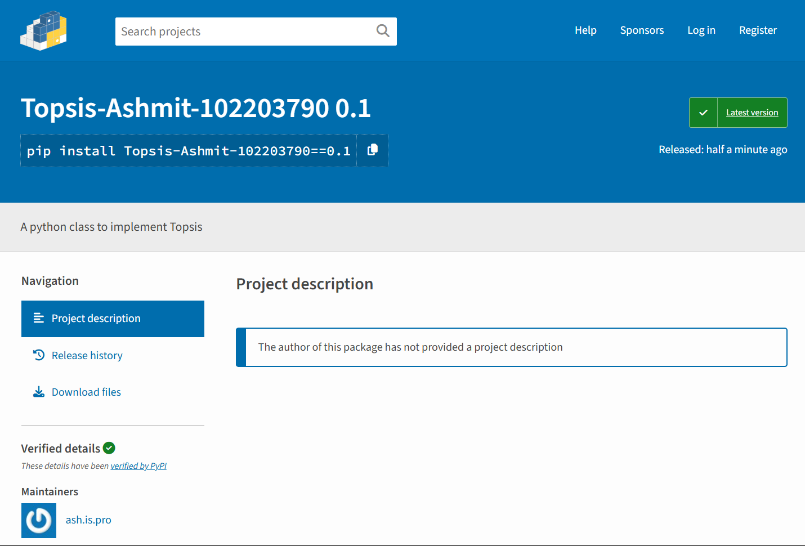

# Topsis

A command line python program to implement TOPSIS.

Link to my Tospis package - `https://pypi.org/project/Topsis-Ashmit-102203790/0.1/`

TOPSIS (Technique for Order of Preference by Similarity to Ideal Solution) is a multi-criteria decision-making (MCDM) method that helps in ranking and selecting a number of alternatives based on multiple criteria. It is widely used in decision-making scenarios where different alternatives are evaluated against various criteria.

## Installation

```shell
pip install Topsis-Ashmit-102203790
```

## Submitted by:

Ashmit Thawait

102203790

3C42


